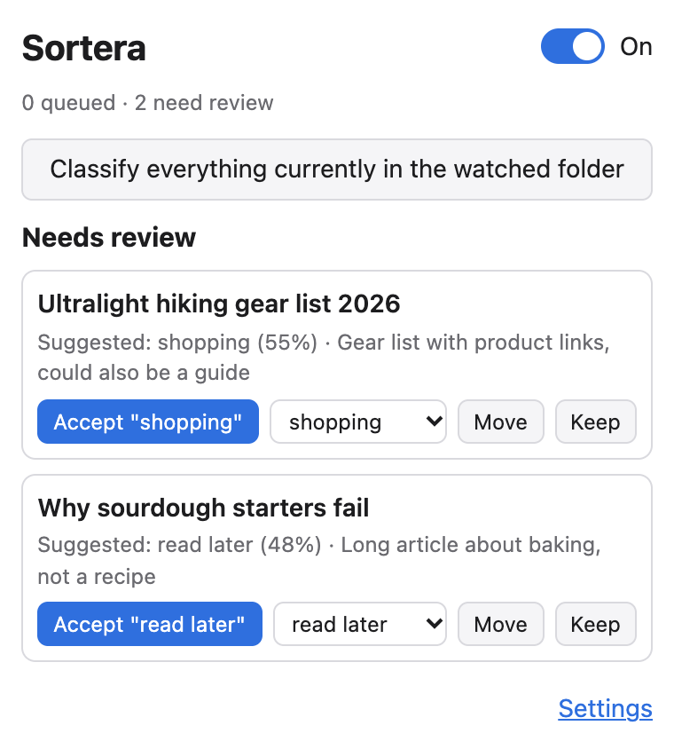
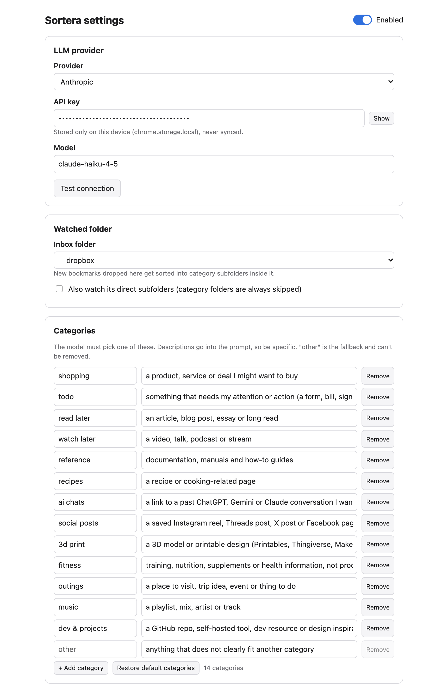

# Sortera

Drop a bookmark into an inbox folder and an LLM sorts it into a category subfolder.
For Brave, Vivaldi, Chrome and other Chromium browsers. Bring your own key (Anthropic, OpenAI, or Ollama).

  
  &nbsp;
  

## Install

1. Open `brave://extensions` or `vivaldi://extensions` and turn on **Developer mode**.
2. Click **Load unpacked** and pick this folder.
3. In settings: add your API key, pick your inbox folder, click **Save**.

## Use

- Bookmark something into the inbox folder. A few seconds later it's sorted.
- Unsure guesses stay in the inbox and show up in the popup for review.
- **Classify everything currently in the watched folder** in the popup handles bookmarks that were already there.
- Edit categories and domain rules in settings; edit the prompt in `lib/prompt.js`.

More: [docs/details.md](docs/details.md) (permissions, Ollama, limitations).

## License

[Lagom License](LICENSE) (Version 2).
